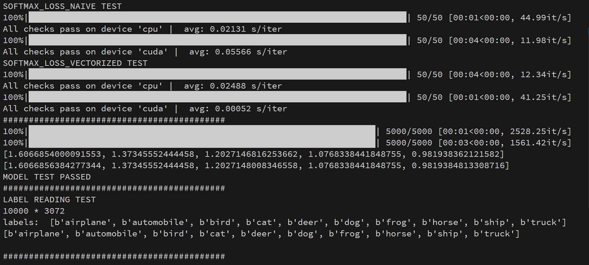
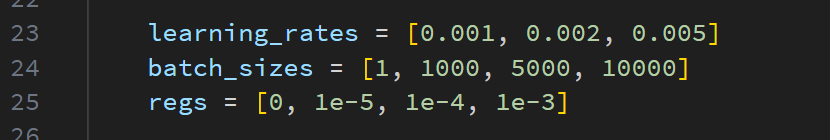
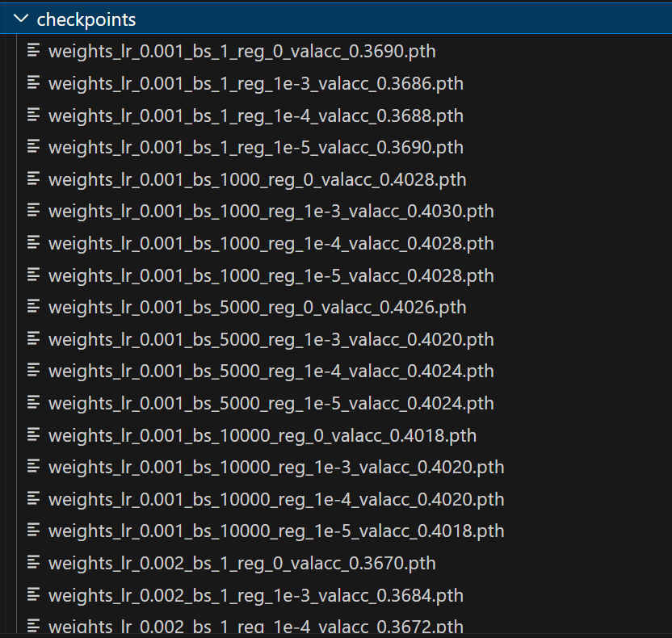
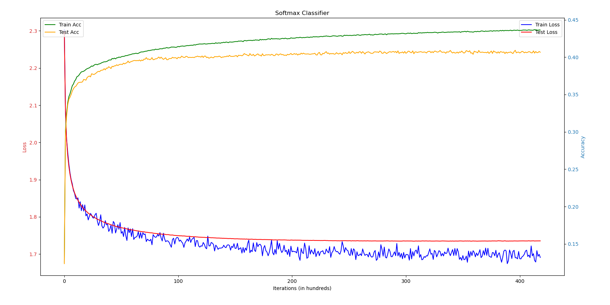
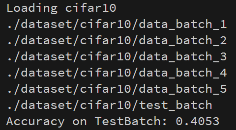
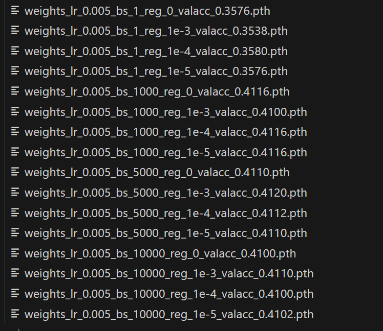

# Softmax Classifier for CIFAR-10
<center> 21307099 李英骏 </center>

#### 代码、报告及`README.md`已上传至[GitHub](https://github.com/KFCFKXQS/ml_and_datamining/tree/main/lec5_hw)和[Gitee](https://gitee.com/Liyj02/ml_and_-data-mining/tree/main/lec5_hw)
#### [demo.py](./code/demo.py)可直接运行，最终在`batchtest`上的准确率为$40.53\%$
## Softmax介绍
- **Softmax简介**: 
  <br>Softmax分类器是一个广泛用于多分类问题的线性分类器。与二分类的逻辑回归不同，Softmax可以处理两个以上的类别。<br>公式表示为：$softmax= \phi_i = \frac{e^{\eta_i}}{\sum_{j=1}^{k} e^{\eta_j}}$ (见正推原理)<br>
- **Softmax线性分类器简介**：
  <br>对于模型的输入$X$,输出
   $$Y=Softmax(XW), y=argmax(Y)$$
   损失函数
$$
\begin{align}
    Loss(X, t;W) &= Loss_{Softmax} + Loss_{L2}\\
    &=CrossEntrophyLoss(Y,t)+reg\cdot R(W)\\
    &= -\sum_{i} t_i\cdot \log(\frac{e^{Y_i}}{\sum_j e^{Y_j}}) + reg\cdot \sum_k w_k^2,\\
    where\\
    Y &= XW
\end{align}
$$
- **反向传播**
$$
\begin{align}
    dW &= \frac{\partial Loss_{Softmax}}{\partial W} + \frac{\partial Loss_{L2}}{\partial W}\\
    &= \frac{X^T(Y_i - T_i)}{Batch\_Size}  + 2\cdot reg\cdot W
\end{align}
$$
- **代码说明**：<br>以[`Softmax_vectorized`](./code/softmax/softmax_vectorized.py)为例

```
def softmax_loss_vectorized(W, X, y, reg, device):
    loss = 0.0
    dW = torch.zeros_like(W, device=device)
    ......
%%_1
    Y = torch.matmul(X, W)  # Y = XW
    max_val = torch.max(Y, dim=1, keepdim=True).values
    Y_exp = torch.exp(Y - max_val)
    Y_softmax = Y_exp / torch.sum(Y_exp, dim=1, keepdim=True)  # softmax(Y)

%%_2
    indices = y.view(-1, 1)
    cross_entrophy = -torch.log(Y_softmax.gather(1, indices).squeeze())
    loss = torch.mean(cross_entrophy)

%%_3
    loss += reg * torch.sum(W*W)

%%_4
    Y_softmax.scatter_(1, indices, Y_softmax.gather(1, indices) - 1)
    Y_softmax /= len(y)
    dW = torch.mm(X.t(), Y_softmax)
    dW += 2 * reg * W

    return loss, dW

```
`%%_1`与`%%2`之间的代码计算了$softmax= \phi_i = \frac{e^{\eta_i}}{\sum_{j=1}^{k} e^{\eta_j}}=\frac{e^{\eta_i-max(\eta)}}{\sum_{j=1}^{k} e^{\eta_j-max(\eta)}}$<br>
`%%_2`与`%%3`之间的代码计算了$CrossEntrophyLoss(Y,t) = -\sum_{i} t_i\cdot \log(\frac{e^{Y_i}}{\sum_j e^{Y_j}})$<br>
`%%_2`与`%%3`之间的代码计算了$L_{2Loss}$<br>
`%%$4`部分的代码计算了$dW=\frac{X^T(Y_i - T_i)}{Batch\_Size}+ 2\cdot reg\cdot W$<br>
[`Naive`](./code/softmax/softmax_naive.py)即是把向量化的部分展开成循环,不再赘述
- **正确性检查**<br>
  在[check.py](./code/check.py)中，使用随机生成的张量，在CPU和Cuda上比较PyTorch自动梯度和手写函数的结果，完全一致<br>
  

## Softmax Classifier
- **代码说明**
  - **`__init__`**<br>
    位于`model.py`中<br>
    ```
    class SoftmaxClassifier:
      def __init__(self, input_dim, num_classes=10,
                   learning_rate=1e-2, reg=1e-5,
                   device='cpu', seed=None):
          # set seed
          seed_init(seed)
          self.W = torch.randn(input_dim, num_classes, device=device) * 0.001
          self.lr = learning_rate
          self.reg = reg
          self.device = device
          self.seed = seed
    ```

    `SEED`默认为0
  - **`train`**<br>
    ```
        def train(self,
                X_train, Y_train, X_test, Y_test,
                num_iters=100, batch_size=200,
                verbose=True, early_stopping = False, wait=10):
            ......
            if early_stopping:
                best_test_accuracy = 0.0 
                patience = wait # epochs to wait
                wait = 0  # counter
        %%_1    #初始化seed保证可以复现，注意不要初始化到循环里面选minibatch的地方，不然随机器一直是初始状态，每次iter选择的数据都是一样的          
            seed_init(self.seed)

            from tqdm import tqdm
            for iteration in tqdm(range(num_iters)):
                batch_indices = torch.randint(0, num_train, (batch_size, ))

        %%_2    # 选取minibatch
                X_batch = X_train[batch_indices]
                Y_batch = Y_train[batch_indices]

        %%_3    #反向传播及梯度下降
                loss, dW = softmax_loss_vectorized(
                    self.W, X_batch, Y_batch, self.reg, self.device)
                
                self.W -= self.lr * dW
                test_preds = self.predict(X_test)
        %%_4    计算准确率
                test_accuracy = self.accuracy(test_preds, Y_test)
                if early_stopping:
                    if test_accuracy > best_test_accuracy:
                        ......
                        # Save the best model weights
                        wait = 0
                    else:
                            wait += 1

                if early_stopping and wait >= patience:
                    ......
                if iteration == 0 or (iteration+1) % 100 == 0:
                    ...#保存训练LOSS ACC
                    if verbose :
                        #打印训练数据
    
            return train_loss_history, test_loss_history, train_acc_history, test_acc_history, best_test_accuracy
    ```

    具体代码说明见注释，注意：<br>1. SEED不要设置到随机器前面<br>
    2.`best_test_accuracy`需另外输出，因为`test_acc_history`每100个epoch才存一次，不一定是最佳的<br>
    3.`EarlyStopping`的单位是iter，经尝试5000比较合理。注意性能提升后置0


 - **正确性检查**<br>
    与check.py中用pytorch内置线性层`Linear`,损失函数`CrossEntropyLoss()`和优化器`SGD`创建的模型进行比较，内容为拟合随机生成的argmax
```
class SoftmaxClassifierTorch(nn.Module):
    def __init__(self, input_dim, num_classes=10,
                 learning_rate=1e-2, reg=1e-5,
                 device=torch.device('cpu'), seed=None):
        super(SoftmaxClassifierTorch, self).__init__()

        
        self.fc = nn.Linear(input_dim,num_classes,  bias=False,
                            device=device)  # Softmax without bias
        seed_init(seed)
        self.fc.weight.data = torch.randn(input_dim, num_classes,device=device).t()
        self.fc.weight.data *= 0.001

        self.lr = learning_rate
        self.reg = reg
        self.device = device
        self.criterion = nn.CrossEntropyLoss()
        self.seed = seed
```
结果完全一致

## Training

- **训练**<bn>
  ```
  CIFAR10_URL = "https://www.cs.toronto.edu/~kriz/cifar-10-python.tar.gz"
  DATASET_DIR = "./dataset/cifar10"
    if __name__ == "__main__":
        download_and_extract_cifar10(url=CIFAR10_URL, dataset_dir=DATASET_DIR)
        device = torch.device('cuda' if torch.cuda.is_available() else 'cpu')
        # device = torch.device('cpu')
        X_train, Y_train, X_val, Y_val, X_test, Y_test = load_cifar_10(seed=SEED)
  ```
  通过`load_cifar_10`函数载入训练集、验证集、测试集，`SEED`同样默认为0。 $验证集:训练集=0.1(可调)$
- **调参技巧（网格化搜索）**<br>
使用的训练技巧：<br>
1.先单次训练，确定大致的参数范围，再在`train.py`中使用网格搜索进行调参：<br>
2.使用了GPU加速训练<br>
3.使用了EarlyStopping技术<br>`EarlyStopping`设置为5000，所有训练得到的参数存入`checkpoints`文件夹中:

4.使用了L2正则化<br>

最终获得的效果最好的参数是：$lr=0.005,bs=5000,reg=1e-3$<br>
在验证集上的准确率为$val\_acc=0.4120\%$

- **测试集性能**<br>
运行demo.py,在测试集(`batchtest`)上的准确率为$test\_acc=40.53\%$


## 分析

可以看出：<br>1.由于数据集较简单且模型参数较少，模型始终处于欠拟合状态，因此`reg`参数对`accuracy`影响很小,只要不要大于1e-2即可，否则会导致梯度消失出现inf<br>
2.只要学习率小于0.01，学习率对结果也基本没有影响。<br>3.而`batch_size`过小时，模型训练时的稳定性很差，导致最终的`acc`也较低。<br>

## 文件说明<br>
1、模型设置了Earlystopping,可调。节约训练时间并防止过拟合（尽管并不会）<br>
2、在`train.py`中初始化了所有`SEED=0`，可调。<br>
3、`demo.py`和`model.py`可以直接运行，自动下载数据集（有网络时），否则可以将`cifar10_python`的7个`.pth`文件放入`./code/dataset/cifar10/`中
4、具体文件功能说明见README.md 
5、已上传至 https://github.com/KFCFKXQS/ml_and_datamining/tree/main/lec5_hw 和 https://gitee.com/Liyj02/ml_and_-data-mining/tree/main/lec5_hw
