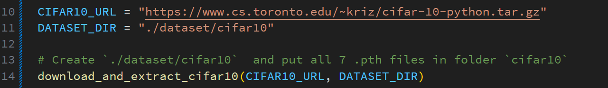
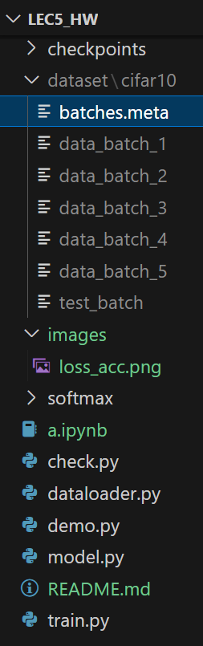
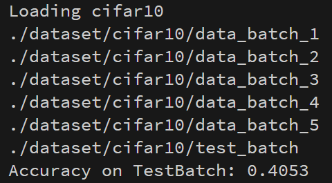
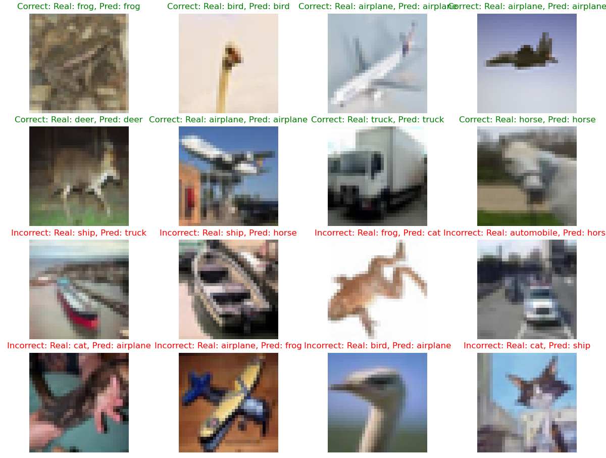
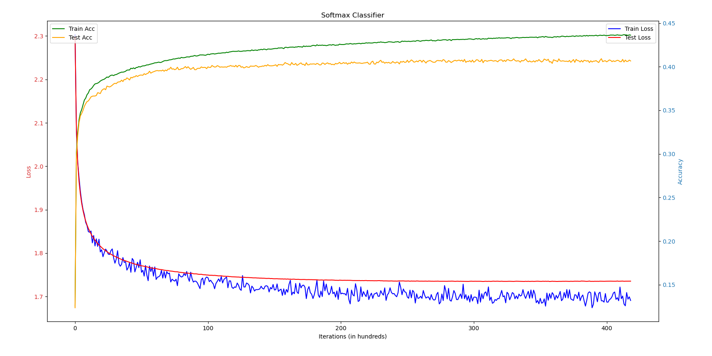
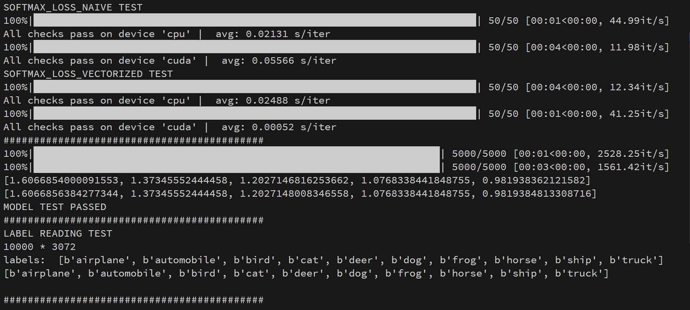
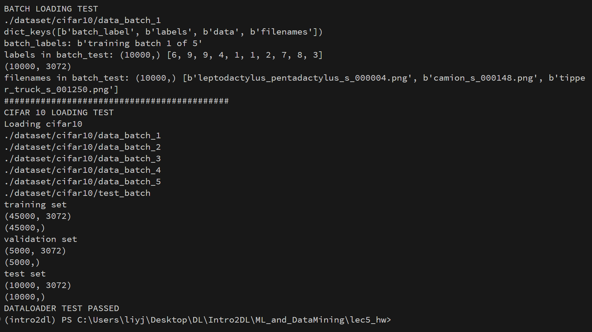

# Softmax Classifier for CIFAR-10

## Overview
This repository contains code for training and testing a softmax classifier on the CIFAR-10 dataset.

## Files and Directories Description

- **demo.py**: Demonstrates the model's classification performance on the test batch. It can be directly executed to view the results.

- **train.py**: Contains the training function for the model. The SEED is set to 0 to ensure reproducibility.

- **check.py**: Provides model checks using PyTorch's built-in functions. It verifies various functionalities including `softmax_loss_naive`, `softmax_loss_vectorized`, data loading, model training, and outputs.

- **dataloader.py**: Handles data loading operations.

- **softmax/**: This directory contains the naive and vectorized implementations of the softmax loss function.

- **checkpoints/**: Contains the weights saved during model training.

- **dataset/**: The directory where the CIFAR-10 dataset in `.pth` format should be placed. If you're using the `cifar10-python` version, make sure to place the files under `dataset/cifar10`.

- **loss_acc.png**: An image visualizing the loss and accuracy during training.

- **model.py**: The model definition for the softmax classifier.

## Setup and Usage

1. **Data Setup**: 
   - Create a directory named `dataset`.
   - Run `demo.py` or `train.py` to automaticly download `CIFAR-10`:
   - Or you can manually place the CIFAR-10 dataset (in `.pth` format) [download](https://www.cs.toronto.edu/~kriz/cifar-10-python.tar.gz) inside `dataset/cifar10` like this:
    
   - 
2. **Demonstration**: 
   - To see the model's performance on the test batch, run `demo.py`.
   - Final Accuray on Test Batch is `40.53%`
   - 
   - 
3. **Training**: 
   - Run `train.py` to start the training process, the `SEED` is set to zero.
   - The weights will be saved under the `checkpoints` directory.
   - 

4. **Model Verification**:
   - Use `check.py` to verify various functionalities of the model.
   - If you see this, the code is working correctly.
   - 
   - 

   

## Notes
The training process is designed to be completely reproducible due to the fixed SEED value.

